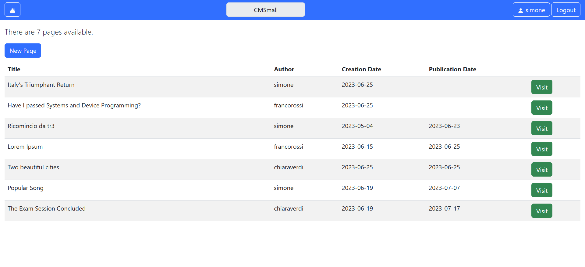
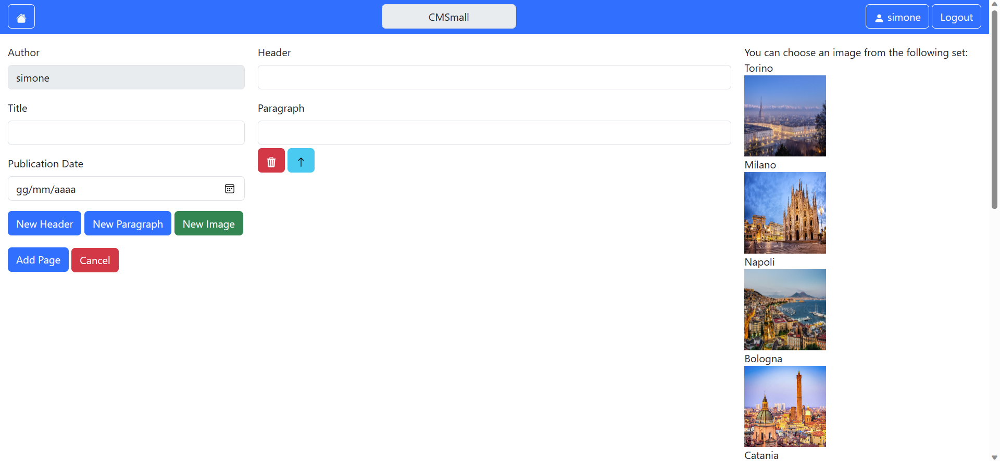

# Exam #N1: "CMSmall"
## Student: Varriale Simone 

## React Client Application Routes

- Route `/`: show all the published pages
- Route `/pages/:pageId `: show the content of the page identified by pageId
- Route `/pages/addPage `: show the form to add a new page with all the relevant field to create it
- Route `/pages/:pageId/edit `: show the precompiled form with all the already present block to update a page identified by pageId
- Route `/yourPages`: show the personal area with only the pages created by the user
- Route `/login`: show the login form in order to perform authentication
- Route `/*`: to handle all the undefined route


## API Server


### User management

### Login

* HTTP method: `POST`  URL: `/api/sessions`
* Description: authenticate the user who is trying to login
* Request body: credentials of the user who is trying to login

``` JSON
{
    "username": "username",
    "password": "password"
}
```

* Response: `200 OK` (success)
* Response body: authenticated user

``` JSON
{
    "id": 1,
    "username": "username", 
    "role": "Regular"
}
```

* Error responses:  `500 Internal Server Error` (generic error), `401 Unauthorized User` (login failed)

### Check if user is logged in

* HTTP method: `GET`  URL: `/api/sessions/current`
* Description: check if current user is logged in and get her data
* Request body: _None_
* Response: `200 OK` (success)

* Response body: authenticated user

``` JSON
{
    "id": 1,
    "username": "username", 
    "role": "Regular"
}
```

* Error responses: `500 Internal Server Error` (generic error), `401 Unauthorized User` (user is not logged in)

### Logout

* HTTP method: `DELETE`  URL: `/api/sessions/current`
* Description: logout current user
* Request body: _None_
* Response: `200 OK` (success)

* Response body: _None_

* Error responses: `500 Internal Server Error` (generic error), `401 Unauthorized User` (user is not logged in)

### Get all users

* HTTP method: `GET`  URL: `/api/users`
* Description: Get all the users of the application
* Request body: _None_
* Response: `200 OK` (success)
* Response body: Array of strigs, each describing one username:

``` json
[
  "Username 1",
  "Username 2",
  ...
]
```
* Error responses:  `500 Internal Server Error` (generic error)

### Page management
### Get all pages (for logged users)

* HTTP method: `GET`  URL: `/api/pages`
* Description: Get the full list of pages
* Request body: _None_
* Response: `200 OK` (success)
* Response body: Array of objects, each describing one page:

``` json
[
  {
    "id": 1,
    "title": "Title 1",
    "author": "Author 1",
    "creationDate": "2023-06-22",
    "publicationDate": "2023-06-22"
  },
  {
    "id": 2,
    "title": "Title 2",
    "author": "Author 2",
    "creationDate": "2023-06-22",
    "publicationDate": ""
  },
  ...
]
```
* Error responses: `401 Not authorized` (generic error)
* Error responses:  `500 Internal Server Error` (generic error)

### Get filtered pages (for non-logged users)

* HTTP method: `GET`  URL: `/api/filteredPages`
* Description: Get the full list of pages
* Request body: _None_
* Response: `200 OK` (success)
* Response body: Array of objects, each describing one page:

``` json
[
  {
    "id": 1,
    "title": "Title 1",
    "author": "Author 1",
    "creationDate": "2023-06-22",
    "publicationDate": "2023-06-22"
  },
  {
    "id": 2,
    "title": "Title 2",
    "author": "Author 2",
    "creationDate": "2023-06-22",
    "publicationDate": "2023-06-22"
  },
  ...
]
```
* Error responses:  `500 Internal Server Error` (generic error)

### Get content of a single page

* HTTP method: `GET`  URL: `/api/pages/:pageId`
* Description: Get the content of a single page
* Request body: _None_
* Response: `200 OK` (success)
* Response body: Array of objects each one describing a block of content

``` json
[
  {
    "id": 1,
    "type": "Header",
    "value": "Header",
    "position": 0,
  },
  {
    "id": 2,
    "type": "Paragraph",
    "value": "Paragraph",
    "position": 1
  },
  {
    "id": 3,
    "type": "Image",
    "value": "/Images/Napoli.png",
    "position": 2
  },
  ...
]
```
* Error responses:  `404 Not found` (generic error)
* Error responses:  `500 Internal Server Error` (generic error)

### Add a new page

* HTTP method: `POST`  URL: `/api/pages`
* Description: Add a new page to the list
* Request body: It is composed by 2 object, one for the page table and one for the content (array of objects). The id is ignored, it will be automatically computed by the DB server-side. The pageId for the content is automatically retrieved so it is not sent in the body.

``` JSON
{
    "id": 1,
    "title": "New Page",
    "author": "Author 1",
    "creationDate": "2023-06-22",
    "publicationDate": "2023-06-22"
},
[
  {
    "id": 1,
    "type": "Header",
    "value": "Header",
    "position": 0,
  },
  {
    "id": 2,
    "type": "Paragraph",
    "value": "Paragraph",
    "position": 1
  },
  {
    "id": 3,
    "type": "Image",
    "value": "/Images/Napoli.png",
    "position": 2
  },
  ...
]
```

* Response: `201 Created` (success)
* Response body: the object as represented in the database
* Error responses: `401 Not authorized` (generic error)
* Error responses: `422 Unprocessable Content` (generic error)
* Error responses: `503 Service Unavailable` (database error)

### Update an existing page

* HTTP method: `PUT`  URL: `/api/pages/:pageId`
* Description: Update an existing page
* Request body: It is composed by 2 object, one for the page table and one for the content (array of objects). The pageId for the content is automatically retrieved so it is not sent in the body.

``` JSON
{ 
    "id": 1,
    "title": "New Page",
    "author": "Author 1",
    "creationDate": "2023-06-22",
    "publicationDate": "2023-06-22"
},
[
  {
    "id": 1,
    "type": "Header",
    "value": "Header",
    "position": 0,
  },
  {
    "id": 2,
    "type": "Paragraph",
    "value": "Paragraph",
    "position": 1
  },
  {
    "id": 3,
    "type": "Image",
    "value": "/Images/Napoli.png",
    "position": 2
  },
  ...
]
```

* Response: `200 OK` (success)
* Response body: the object as represented in the database
* Error responses: `401 Not authorized` (generic error)
* Error responses: `422 Unprocessable Content` (generic error)
* Error responses: `404 Not found` (generic error)
* Error responses: `503 Service Unavailable` (database error)

### Delete an existing page

* HTTP method: `DELETE`  URL: `/api/pages/:pageId`
* Description: Delete an existing page
* Request body: _None_

* Response: `200 OK` (success)
* Response body: an empty object
* Error responses: `404 Not found` (generic error)
* Error responses: `401 Not authorized` (generic error)
* Error responses:  `503 Service Unavailable` (database error)

### Get all images

* HTTP method: `GET`  URL: `/api/images`
* Description: Get the set of predefined images
* Request body: _None_
* Response: `200 OK` (success)
* Response body: Array of objects, each describing one image:

``` json
[
  {
    "path": "/Images/Torino.jpg",
    "name": "Torino"
  },
  {
    "path": "/Images/Milano.jpg",
    "name": "Milano"
  },
  ...
]
```
* Error responses:  `500 Internal Server Error` (generic error)

### Get the title of the application

* HTTP method: `GET`  URL: `/api/nameSite`
* Description: Get the name of the application
* Request body: _None_
* Response: `200 OK` (success)
* Response body: a variable called name:

``` json
[
  "Name"
]
```
* Error responses:  `500 Internal Server Error` (generic error)

#### Update the title of the application

* HTTP method: `PUT`  URL: `/api/nameSite`
* Description: Update the name of the application
* Request body: New value of the name

``` JSON
[
  "Name"
]
```

* Response: `200 OK` (success)
* Error responses: `401 Not authorized` (generic error)
* Error responses: `422 Unprocessable Content` (generic error)
* Error responses:  `503 Service Unavailable` (database error)


## Database Tables

- Table `USER` (id - username (PK) - password - pwSalt -role)
- Table `PAGE` (id (PK) - title - author - creation date - publication date)
- Table `CONTENT` (id (PK) - pageId (FK) -type - value - position)
- Table `IMAGE` ( id (PK) - path - name)
- Table `NAMESITE` ( id (PK) - name)

## Main React Components

All the files belonging to the `/src` folder of the React application are organized as follows:
- `/src/API`: contains all the API to communicate with the server
- `/src/Model.js`: contains the function to construct object for page and content
- `/src/App.jsx`: contains all the function needed to invoke the API and compute the result passed to the local component
- `/src/components`: it is a folder that contains all the file the components used for the front-end logic. It contains:
  - **PageList**: show the list of all pages organized into a table
  - **SinglePage**: shows information about the page and then shows the blocks of content of the page
  - **PageForm**: shows the form used to add/edit a single page in order to add/delete/modify a block
  - **AuthComponent**: shows the form used to perform the login of a user
  - **Images**: it is the component that shows the set of predefined images
  - **Navbar**: shows the navbar which is always present at the top of the screen and it contains the button to go home, the title of the application, the button for personal area (if the user is logged) and login/logout button
  - **NotFound**: This layout is displayed if the url doesn't match any of the declared routes
  - **Loading**: This layout is displayed if the application is retrieving information
- `/src/layout`: it is a folder that contains the possible layout of the application according to the route
  - **MainLayout**: shows the home page of the application
    
    - **Route**:  called when route is (`/`)
    - **Component**:  `Paragraph` displaying the number of available pages, button to create a `New Page` (only for logged in users) and `PageList`
  - **PageLayout**: layout to show the content of a single page
    - **Route**:  called when route is (`/pages/:pageId`)
    - **Component**:  `SinglePage` displaying the content of the page or if the `pageId` is not valid a message saying that the page does not exists.
  - **PersonalLayout**: shows the layout for personal page of the loggedIn user
    - **Route**:  called when route is (`/yourPages`)
    - **Component**:  `Paragraph` displaying a welcome message for the user, the number of created pages, a button to create a `New Page` (only for logged in users) and `PageList` filtered according to the username.

## Screenshot
**Home Page**

**Page Form**


## Users Credentials

|     Username    |   Password   | Role|
| :--------------------: | :----------: |  :----------: |
|  simone  | password | Regular |
|  chiaraverdi  | password | Admin |
|  francorossi  | password | Admin |
|  mariobianchi  | password | Regular |

